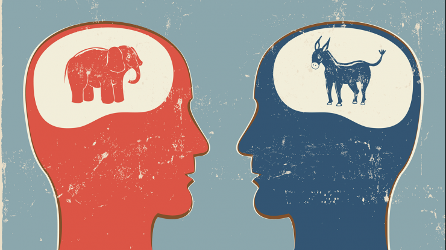

# Applied Data Science @ Columbia
## Fall 2020
## Project 1: A "data story" on how Americans vote
### by Natalie Williams


### [Project Description](doc/)
Term: Fall 2020

+ Project title: Political Polarization: Buzz Word or Real?
+ This project is conducted by Natalie Williams

+ Project summary: Media coverage of 'Political Polarization' has surged in recent years, and so have
fears and anxieties about American democracy along with it. As more Americans become suspicious of their preferred news source, and more social media platforms admit to filter for articles that may match the opinion of their site's user, it can be hard to decide what causes are legit and thus become worrisome. In this analysis, 
I investigated if Democrats and Republicans really have grown further apart in the past few decades, and if so, can that be measured by survey responses. The results show polarization of Strong Democrats and Republicans varies based on the issue. Social issues like Abortion and Healthcare have seen the large swings. While views on Military Spending, see little divergence between parties. This difference could result the intangibility of military spending. There is no mandatory military service in America (aside from drafts), and there have been no wars fought on American soil since the 1800's. So, the military and military spending is much less tangible to most citizens. Healthcare, on the other hand, is very much part of a family's daily life, and the ability to obtain an abortion is life changing. These two issues also strike closely to Republican values: small government and religiosity. This creates a perfect storm for Democrats and Republicans to move to the further fringes of the ideological spectrum. Finally, political polarization has increased since the 1970's, and is most clearly seen in social issues that citizens are more likely to have first hand experience with. 


Following [suggestions](http://nicercode.github.io/blog/2013-04-05-projects/) by [RICH FITZJOHN](http://nicercode.github.io/about/#Team) (@richfitz). This folder is organized as follows.

```
proj/
├── dev/
├── data/
├── doc/
├── figs/
└── output/
```

